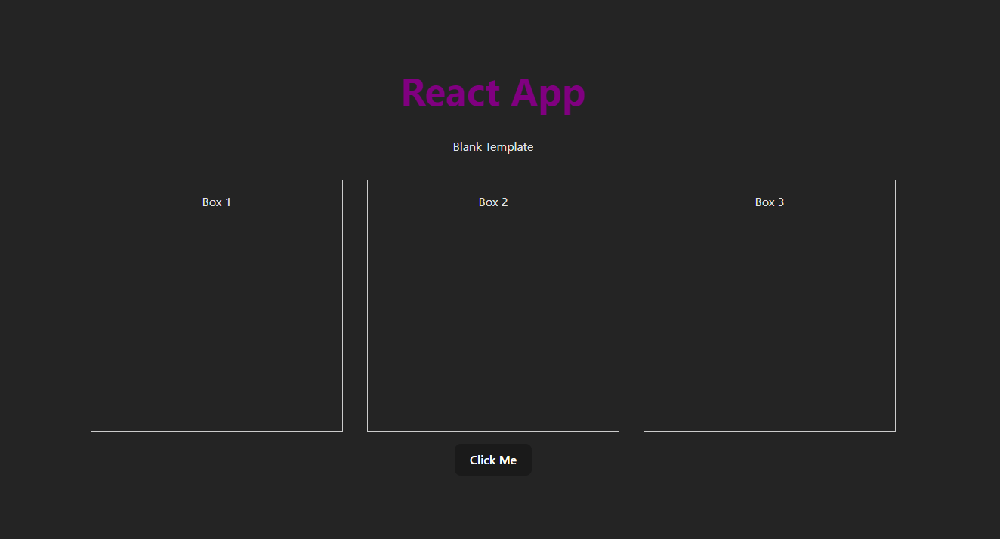

# React + Vite

This template provides a minimal setup to get React working in Vite with HMR and some ESLint rules.

Currently, two official plugins are available:

- [@vitejs/plugin-react](https://github.com/vitejs/vite-plugin-react/blob/main/packages/plugin-react/README.md) uses [Babel](https://babeljs.io/) for Fast Refresh
- [@vitejs/plugin-react-swc](https://github.com/vitejs/vite-plugin-react-swc) uses [SWC](https://swc.rs/) for Fast Refresh

# Getting React App Started

### [codesandbox](https://codesandbox.io/p/github/GDSC-UVic/react-start/main?layout=%257B%2522sidebarPanel%2522%253A%2522GIT%2522%252C%2522rootPanelGroup%2522%253A%257B%2522direction%2522%253A%2522horizontal%2522%252C%2522contentType%2522%253A%2522UNKNOWN%2522%252C%2522type%2522%253A%2522PANEL_GROUP%2522%252C%2522id%2522%253A%2522ROOT_LAYOUT%2522%252C%2522panels%2522%253A%255B%257B%2522type%2522%253A%2522PANEL_GROUP%2522%252C%2522contentType%2522%253A%2522UNKNOWN%2522%252C%2522direction%2522%253A%2522vertical%2522%252C%2522id%2522%253A%2522clp8zid1j00073p6gjgcagppl%2522%252C%2522sizes%2522%253A%255B70%252C30%255D%252C%2522panels%2522%253A%255B%257B%2522type%2522%253A%2522PANEL_GROUP%2522%252C%2522contentType%2522%253A%2522EDITOR%2522%252C%2522direction%2522%253A%2522horizontal%2522%252C%2522id%2522%253A%2522EDITOR%2522%252C%2522panels%2522%253A%255B%257B%2522type%2522%253A%2522PANEL%2522%252C%2522contentType%2522%253A%2522EDITOR%2522%252C%2522id%2522%253A%2522clp8zid1i00033p6go2oqsef8%2522%257D%255D%257D%252C%257B%2522type%2522%253A%2522PANEL_GROUP%2522%252C%2522contentType%2522%253A%2522SHELLS%2522%252C%2522direction%2522%253A%2522horizontal%2522%252C%2522id%2522%253A%2522SHELLS%2522%252C%2522panels%2522%253A%255B%257B%2522type%2522%253A%2522PANEL%2522%252C%2522contentType%2522%253A%2522SHELLS%2522%252C%2522id%2522%253A%2522clp8zid1i00053p6gtb1o77p1%2522%257D%255D%252C%2522sizes%2522%253A%255B100%255D%257D%255D%257D%252C%257B%2522type%2522%253A%2522PANEL_GROUP%2522%252C%2522contentType%2522%253A%2522DEVTOOLS%2522%252C%2522direction%2522%253A%2522vertical%2522%252C%2522id%2522%253A%2522DEVTOOLS%2522%252C%2522panels%2522%253A%255B%257B%2522type%2522%253A%2522PANEL%2522%252C%2522contentType%2522%253A%2522DEVTOOLS%2522%252C%2522id%2522%253A%2522clp8zid1i00063p6gt7p17hzg%2522%257D%255D%252C%2522sizes%2522%253A%255B100%255D%257D%255D%252C%2522sizes%2522%253A%255B60%252C40%255D%257D%252C%2522tabbedPanels%2522%253A%257B%2522clp8zid1i00033p6go2oqsef8%2522%253A%257B%2522id%2522%253A%2522clp8zid1i00033p6go2oqsef8%2522%252C%2522tabs%2522%253A%255B%255D%257D%252C%2522clp8zid1i00063p6gt7p17hzg%2522%253A%257B%2522id%2522%253A%2522clp8zid1i00063p6gt7p17hzg%2522%252C%2522activeTabId%2522%253A%2522clp8zizkl00ff3p6g23uxjeui%2522%252C%2522tabs%2522%253A%255B%257B%2522type%2522%253A%2522PROJECT_SETUP%2522%252C%2522id%2522%253A%2522clp8zizkl00ff3p6g23uxjeui%2522%252C%2522mode%2522%253A%2522permanent%2522%257D%255D%257D%252C%2522clp8zid1i00053p6gtb1o77p1%2522%253A%257B%2522id%2522%253A%2522clp8zid1i00053p6gtb1o77p1%2522%252C%2522activeTabId%2522%253A%2522clp8ziea9008c3p6g0pzqiq15%2522%252C%2522tabs%2522%253A%255B%257B%2522id%2522%253A%2522clp8zid1i00043p6gc5rwsu1c%2522%252C%2522mode%2522%253A%2522permanent%2522%252C%2522type%2522%253A%2522TERMINAL%2522%252C%2522shellId%2522%253A%2522clp8zid47000lehh612p45j78%2522%257D%252C%257B%2522type%2522%253A%2522TASK_LOG%2522%252C%2522taskId%2522%253A%2522dev%2522%252C%2522id%2522%253A%2522clp8ziea9008c3p6g0pzqiq15%2522%252C%2522mode%2522%253A%2522permanent%2522%257D%252C%257B%2522type%2522%253A%2522TASK_LOG%2522%252C%2522taskId%2522%253A%2522CSB_RUN_OUTSIDE_CONTAINER%253D1%2520devcontainer%2520templates%2520apply%2520--template-id%2520%255C%2522ghcr.io%252Fdevcontainers%252Ftemplates%252Fjavascript-node%255C%2522%2520--template-args%2520%27%257B%257D%27%2520--features%2520%27%255B%255D%27%2522%252C%2522id%2522%253A%2522clp8ziyf800ad3p6g1245r952%2522%252C%2522mode%2522%253A%2522permanent%2522%257D%255D%257D%257D%252C%2522showDevtools%2522%253Atrue%252C%2522showShells%2522%253Atrue%252C%2522showSidebar%2522%253Atrue%252C%2522sidebarPanelSize%2522%253A15%257D)

## 1. Fork the Git Repository

- **Create a GitHub Account**: If you don't have one, sign up and sign in.
- **Fork the Repository**: Click on the 'Fork' button.
- **Name Your Repository**: Title it `GDSC_Dino`.

## 2. Cloning Your Repository

1. **Open a Command Prompt/Terminal**.
2. **Create a Folder for the Workshop**:
 ```
mkdir GDSC_Workshop
```
3. **Change Directories to the New Folder**: 
 ```
cd ./GDSC_Workshop
```
4. **Clone the Repository**:
 ```
git clone https://github.com/yourusername/GDSC_Dino.git
```

5. **Navigate to the Cloned Directory**:
 ```
cd GDSC_Dino
```
## 3. Install Dependencies

Run the following commands to install necessary dependencies:
```
 npm install
```
```
 npm run dev
```


## 4. Starting the Development Server
- **press `O` to Open a Browser** and navigate to the appropriate URL (usually `localhost:3000`).

## 5. Check Starter Code
- This is what your starter code should look like. After every change, press `R` to restart the server.


## 6. Making Changes
- **Update `./index.html`**: Title it "Dino Game React".
- **Modify `App.jsx`**: Located at `./src/App.jsx`. Add "Starter Code" comment.
- **Change `App.css`**: Update the background color.
- **Add a Console Log**: In `App.jsx`, add `console.log("hello world");`.
 ```
console.log("hello world");
```

## 7. Make Changes and Push to GitHub
1. **Check Status**:
 ```
git status
```
2. **Add Changes**: 
 ```
git add .
```
3.  **Commit Changes**: 
 ```
git commit -m 
"updated the title"
```
4. **Push to GitHub**: 
 ```
git push 
```

