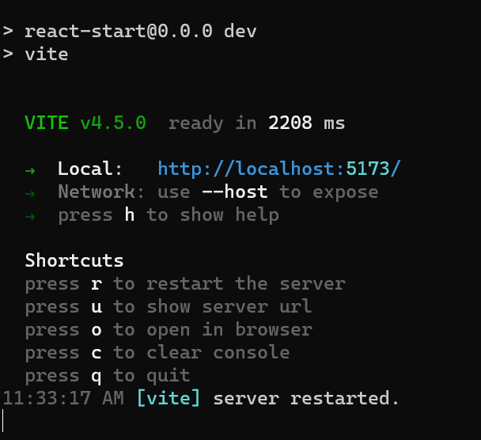

# React + Vite

This template provides a minimal setup to get React working in Vite with HMR and some ESLint rules.

Currently, two official plugins are available:

- [@vitejs/plugin-react](https://github.com/vitejs/vite-plugin-react/blob/main/packages/plugin-react/README.md) uses [Babel](https://babeljs.io/) for Fast Refresh
- [@vitejs/plugin-react-swc](https://github.com/vitejs/vite-plugin-react-swc) uses [SWC](https://swc.rs/) for Fast Refresh

# Steps to Getting React App Started:

## Fork the Git Repo
1. Make a Github account if you done have one, sign in
2. Click fork
3. Give it a title: GDSC_Dino
4. Cool have new Github repo!

## Cloning your repo
1. open a cmd prompt / terminal
2. make a folder for this workshop : mkdir GDSC_Workshop
3. change directories to that folder: cd ./GDSC_Workshop
4. code<> clone by https : git clone https://github.com/username/GDSC_Dino
5. cd GDSC_Dino

## Install Dependencies
1. npm install
2. npm run dev

3. open a browser type: o

4. this is what your starter code should look like
5. after every change press r to retart the server

## make a change
1. ./index.html : Dino Game React
1. (App.jsx)[.\src\App.jsx]: "Starter Code"
2. App.css : change background colour
3.(App.jsx)[.\src\App.jsx]: console.log("hello world");

## Make a change and push 
1. git status
2. git add .
3. git commit -m "updated the title"
4. git push
